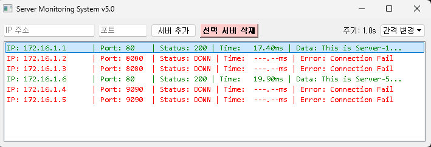

# Server Monitoring System (GUI)

This is a real-time server status monitoring system built with PyQt5. It periodically checks the server's response status, latency, and data via HTTP requests.

## 1. Installation and Setup (Using uv)

This project recommends using `uv` for Python package management.

### Required Packages
The following external libraries are required to run the source code:
- `requests`: For handling HTTP requests
- `PyQt5`: For the GUI

### Installation Commands
Navigate to the project folder in your terminal and run the following commands to create a virtual environment and install the packages.

```bash
# 1. Create a virtual environment (optional)
uv venv

# Activate the virtual environment (on Windows)
.venv\Scripts\activate

# 2. Install packages
uv pip install requests PyQt5
```

## 2. Usage

### Screenshot


### How to Run
```bash
python monitor-gui.py
# Or run directly with uv
uv run monitor-gui.py
```


### Key Features 
- Add Server: Enter the IP and Port in the input fields at the top and click the Add button. (Includes IP validation.) 
- Delete Server: Select an item from the list and click the Delete button or press the Delete key. 
- Change Interval: Click the Interval button at the top to select 0.5s, 1.0s, or 2.0s. 
- Data Persistence: The added server list is automatically saved to the servers.json file and persists across restarts.

### Status Indicators (Color Code) 
- Green: Normal (Status 200, etc.) 
- Red: Connection failed (DOWN) or error occurred. 
- Blue (Bold): Displayed when a change in Data is detected compared to the previous response.

---